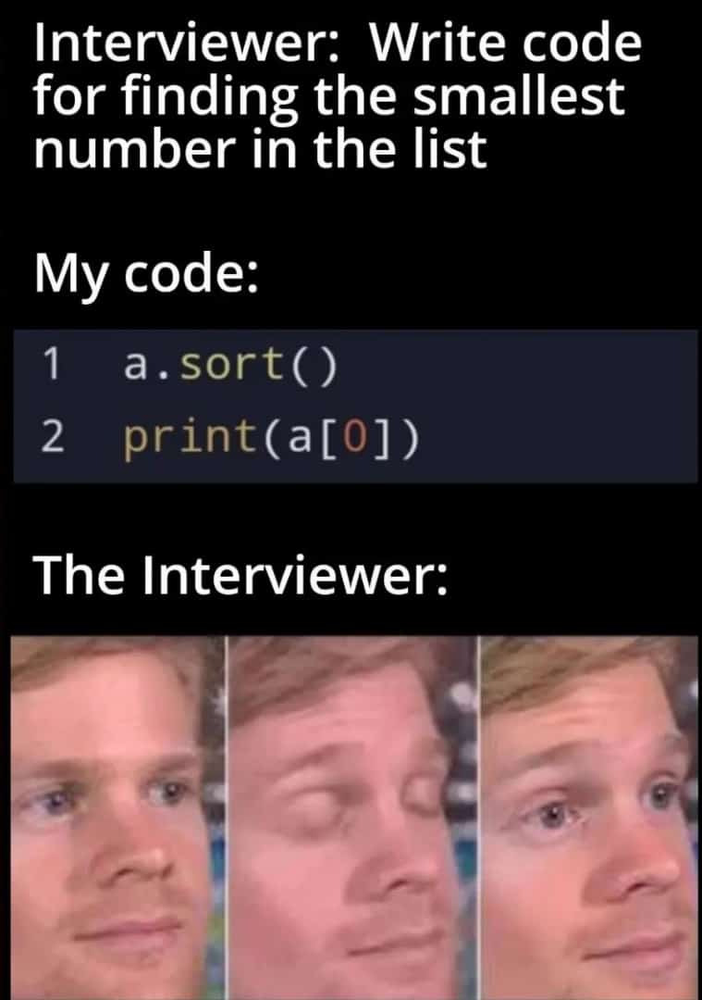

# smallest-number-shorter-version

## Project setup
```
npm install
```

### Run node project
```
node index.js
```

### Run npm project
```
npm start
```

### Contribution to the project
See [My own page](https://charlyceballos.github.io/).

<div>
  
</div>